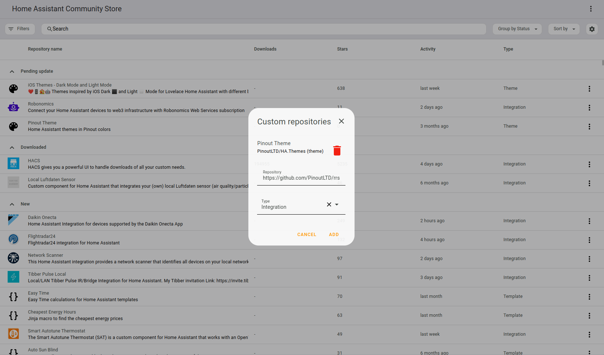

# Robonomics Report Service
Integration for Home Assistant that allows you to send error reports about your smart home to the Robonomics team.

## Requirements
* Libp2p proxy server. Installation instructions are [here](https://github.com/PinoutLTD/libp2p-ws-proxy).

## Installation

**1. Install files**

1.1 Using HACS

In the HACS panel, navigate to `Integrations` and click on the three dots in the upper-right corner. Select `Custom Repositories`, insert the `https://github.com/PinoutLTD/rrs-ha-integration` to `Repository` and choose `Integration` as the type.

1.2 Manually

Clone the [repository](https://github.com/PinoutLTD/rrs-ha-integration) and copy `custom_components` folder to your Home Assistant config directory.

**2. Restart HA to load the integration into HA.**

**3. Go to Settings -> Devices & Services -> Integrations and click the 'Add Integration' button. Look for Robonomics Report Service and click to add it.**

