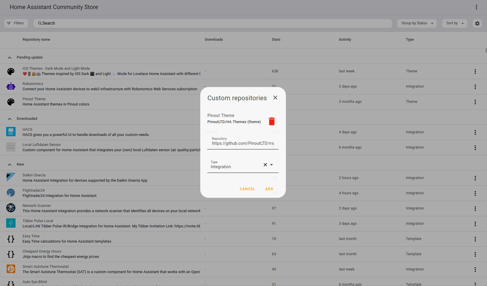

# Robonomics Report Service

Integration for Home Assistant that allows to send error reports about client's smart home to a smart home integrator company.

## How it works

The integration creates error watchers that monitor Home Assistant for various issues and report them every 24 hours. Available watchers:

- `LoggerHandler` — collects all logs with `critical`, `error`, and `warning` levels (in raw and accumulated style)
- `EntitiesStatusChecker` — collects information about entities with the `STATE_UNAVAILABLE` status

### Heartbeat

Reports are sent only when something is wrong, so a silent site is ambiguous: it looks the
same whether the home is healthy or the integration stopped working months ago. Once a day
the integration therefore publishes a small record straight into the datalog — no IPFS, no
Pinata, no encryption, because it says nothing about the home:

```json
{"t":"hb","v":"<integration version>","ha":"<Home Assistant version>","ts":1789905600}
```

The integrator's side treats a missing heartbeat as an event and can tell "quiet because all
is well" from "quiet because it broke". Since the record does not travel through Pinata, it
still arrives when the report path itself is broken — revoked Pinata keys, a gateway outage.
Each site publishes at its own moment of the day, derived from its address, so many sites do
not all write in the same minute; a restart sends one beat a few minutes later and keeps the
site's slot.

### Reports

The information collected by watchers is placed in a JSON issue and, along with the full logs, is encrypted with the integrator's address. The resulting encrypted files are placed in an archive and upload to [Pinata](https://pinata.cloud/), an IPFS pinning service. The resulting IPFS hash of the encrypted file report is sent to the [Robonomics](https://robonomics.network/) parachain as a datalog. After this, the integrator will see the report appear and will be able to download it to handle the problem with the client's smart home.

## Requirements

- Home Assistant 2026.3.1 or newer
- Runs on ARM without a compiler: every dependency ships wheels for `aarch64`,
  both glibc and musl, so a Raspberry Pi or a Home Assistant Green installs the
  same way an x86 box does
- **The site's account must exist on chain.** Publishing through an RWS
  subscription costs nothing, but Robonomics refuses any transaction from an
  account with a zero balance (`InvalidTransaction::Payment`). Send the site's
  address the existential deposit — 0.000001 XRT — once; it is never spent.
- **ED25519 accounts on both sides.** Reports are encrypted by converting
  ed25519 keys to curve25519, so both the site's own account and the
  integrator's address that receives the reports must be ED25519. An SR25519
  account cannot encrypt a report or read one. An SS58 address does not reveal
  its key type, so this cannot be checked when the address is entered: it is a
  setup rule, and the failure would only surface as an unreadable report.

## Installation

**1. Install files**

1.1 Using HACS

In the HACS panel, navigate to `Integrations` and click on the three dots in the upper-right corner. Select `Custom Repositories`, insert the HTML link of this repository to `Repository` and choose `Integration` as the type.



1.2 Manually

Clone the [repository](https://github.com/PinoutLTD/rrs-ha-integration) and copy `custom_components` folder to your Home Assistant config directory.

**2. Restart Home Assistant to load the integration into Home Assistant.**

**3. Go to Settings -> Devices & Services -> Integrations and click the 'Add Integration' button. Look for Robonomics Report Service and click to add it.**

## Configuration


When adding the integration, you need to specify the following fields:

- Network (Polkadot or Kusama)
- Robonomics address of integrator problem service — the address with which files will be encrypted at the client's site and decrypted at the integrator's site
- Pinata public/secret key — Pinata credentials (API keys)
- (Optional) E-mail for receiving solutions from integrator
- (Optional) Robonomics address of subscription owner — by default, the integration creates its own Robonomics address for which you need to purchase a subscription; this field allows to specify another subscription to which you can add the integration address

After that, the integration will generate a Robonomics account (and provide you with a seed phrase). You can also specify an existing account by providing your own seed phrase.
